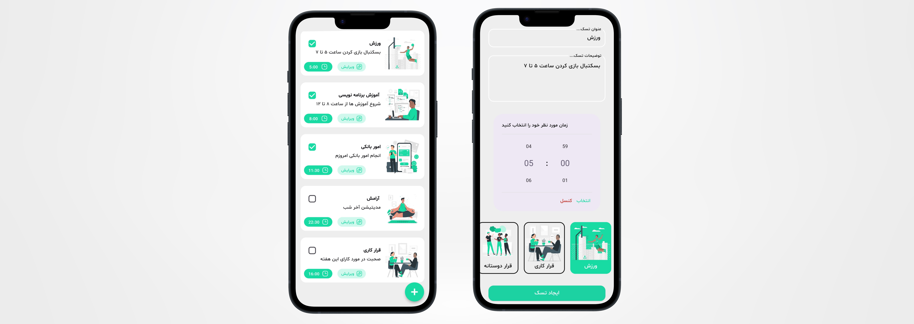

# Todo

## Overview 
A note app written with pure dart language. The user has the ability to choose time, task type, title, subtitle and delete the task if the task is ended. User also has the ability to edit the written task. All the user's tasks will be saved in a NoSQL database so the data is presistant.

## Features
 - **Main Activity** : Works just like a note app. Lists all the tasks with time, title, subtitle, task type and a checkbox.
 - **Task Detail** : Each task and its field can be editted.

   
## Technologies Used
 - Language : Dart
 - Architecture : Bloc
 - Database : Hive
 - Functional Programming : dartz(Either)

## Dependancies 
  - bloc
  - flutter_bloc
  - get_it
  - hive
  - hive_flutter
  - time_pickerr

## Project Structure 
 The project follows bloc architecture for the separation of layers:

BLoC : To handle the logic and send state for the unique event being received.
Data : To handle 3 important layers when working with Database :
Model : which is the entity of the app.
DataSource : To work with database (works just like usecases).
Repositoy : To get data from datasource and handle whether an error occurred or the list has been taken (similar to adapter layer).
UI : Infrastructure layer that is aware of the bloc and can send certain events to it.

## Project Setup
To run the application do the following :

 1. Clone the repository or download it.
 2. Open the project in Android Studio / VScode.
 3. Build and run the app on an Android emulator or physical device by your choice.

